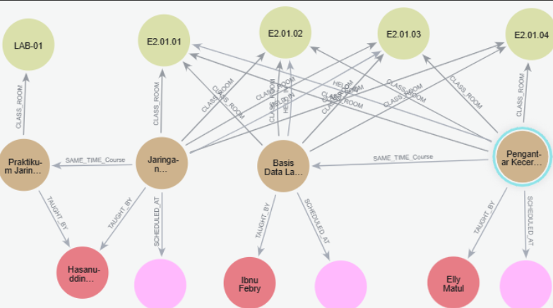

# University Course Scheduling with Neo4j 🗓️
> "Dame un grrraph (¿un qué?)  
> Un grrraph (¿un qué, un qué?)  
> Un grrraph (¿un qué?)  
> Un grrraph"

# Hi We Are
##  Kelompok 13

| Nama | NIM |
|------|-----|
| Devina Sawitri | 22031554036 |
| Alivia Nayla Wibisono | 22031554041 |
| Siti Aida Hanun | 22031554044 |

##  Project Overview

This project implements a **graph-based constraint satisfaction system** for university course scheduling using Neo4j. It tackles scheduling challenges such as professor availability, room capacity, and timing conflicts.

###  What Problem We Solve
-  Avoiding professor double-booking  
-  Ensuring room availability and suitability  
-  Preventing course timing conflicts  
-  Respecting student enrollment patterns  
-  Meeting departmental requirements  

###  Why Graph Database?
Neo4j models relationships naturally:
- **Nodes** → Courses, Professors, Rooms, Time Slots  
- **Relationships** → Constraints and assignments  
- **Paths** → Valid schedule solutions  

##  How to Use This Project

### Prerequisites
- [Neo4j Desktop](https://neo4j.com/download/) or [Neo4j Aura](https://neo4j.com/cloud/aura/)  
- Basic knowledge of Cypher queries  

###  Installation & Setup

1. **Start Neo4j**  
   - Install Neo4j Desktop or create a free Aura account  
   - Start your database instance  

2. **Load the Schema & Data**  
   Open Neo4j Browser and run these files in order:

   ```cypher
   // 1. First, run the schema setup
   :source database/01_schema_setup.cypher

   // 2. Then, load sample data
   :source database/02_sample_data.cypher
   ```

3. **Explore the Data**
   ```cypher
   MATCH (n) RETURN n LIMIT 50
   ```

###  Demo Queries

**1. Find Valid Schedules for "Pengantar AI"**
```cypher
:source database/03_demo_queries.cypher
```

**2. Detect Scheduling Conflicts**
```cypher
MATCH (d:Dosen)-[:TAUGHT_BY]-(mk1:MataKuliah)-[:SCHEDULED_AT]->(w:Waktu),
      (d)-[:TAUGHT_BY]-(mk2:MataKuliah)-[:SCHEDULED_AT]->(w)
WHERE mk1 <> mk2
RETURN d.nama AS Dosen, w.id_waktu AS Waktu, 
       mk1.nama AS Kelas_1, mk2.nama AS Kelas_2
```

**3. View All Constraints**
```cypher
MATCH p=()-[r:CONFLICT_WITH|REQUIRES_ROOM_TYPE|CAN_TEACH]->() 
RETURN p
```

##  Project Structure

```
course-scheduling-graph/
├── database/
│   ├── 01_schema_setup.cypher    # Database constraints & indexes
│   ├── 02_sample_data.cypher     # Sample nodes & relationships
│   └── 03_demo_queries.cypher    # Demonstration queries
├── docs/
│   ├── database_design.md        # Schema explanation
│   └── demonstration_guide.md    # Demo instructions
└── README.md
```

##  Sample Data Included

- **Courses**: Pengantar AI, Basis Data Lanjut, Jaringan Komputer  
- **Professors**: Ibu Elly Matul, Pak Ibnu Febry
- **Rooms**: E2.01.01-E2.01.04, LAB-01
- **Day Slot**: Tuesday-Thursday
- **Time Slots**: 7-9.30, 9.30-12.00, 13.00-15.30, 15.30-18.00 
- **Constraints**: Conflict rules, room requirements, professor preferences  

##  Key Features

-  Constraint Modeling  
-  Conflict Detection  
-  Schedule Validation  

##  Understanding the Graph Schema



**Nodes:**
- `MataKuliah` (Course)  
- `Dosen` (Professor)  
- `RuangKelas` (Room)  
- `Waktu` (Time)
- `Mahasiswa` (Student) 

**Relationships:**
- `CONFLICT_WITH`  
- `CAN_TEACH`  
- `REQUIRES_ROOM_TYPE`  
- `AVAILABLE_AT`  
- `PREFERRED_TIME`
- `ENROLLED_IN`
- `HELD_IN`
- `SCHEDULE_AT`
- `TAUGHT_BY`
