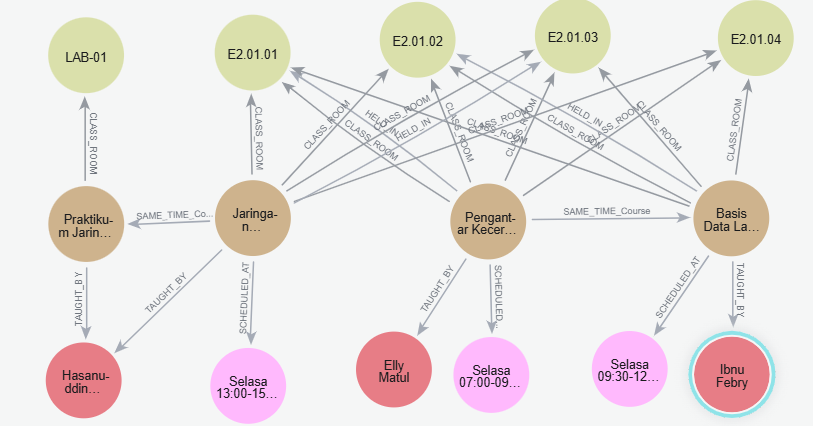

# University Course Scheduling with Neo4j
> "Dame un grrraph (¿un qué?)  
> Un grrraph (¿un qué, un qué?)  
> Un grrraph (¿un qué?)  
> Un grrraph"

## Hi! We Are Kelompok 13!

| Nama | NIM |
|------|-----|
| Devina Sawitri | 22031554036 |
| Alivia Nayla Wibisono | 22031554041 |
| Siti Aida Hanun | 22031554044 |

##  Project Overview

This project implements a **graph-based constraint satisfaction system** for university course scheduling using Neo4j. It tackles scheduling challenges such as professor availability, room capacity, and timing conflicts.

###  What Problem We Solve
-  Avoiding professor double-booking  
-  Ensuring room availability and suitability  
-  Preventing course timing conflicts  
-  Respecting student enrollment patterns  
-  Meeting departmental requirements  

##  How to Use This Project

### Prerequisites
- [Neo4j Desktop](https://neo4j.com/download/) or [Neo4j Aura](https://neo4j.com/cloud/aura/)  
- Basic knowledge of Cypher queries  

###  Installation & Setup

1. **Start Neo4j**  
   - Install Neo4j Desktop or create a free Aura account  
   - Start your database instance  

2. **Load the Schema & Data**  
   Open Neo4j Browser and run these files in order:

   ```cypher
   // 1. First, run the schema setup
   :source database/01_schema_setup.cypher

   // 2. Then, load sample data
   :source database/02_sample_data.cypher
   ```

3. **Explore the Data**
   ```cypher
   MATCH (n) RETURN n LIMIT 50
   ```

###  Demo Queries

**Find Valid Schedules and Run the Demo**
- See detailed walkthrough and copy-paste-ready queries in `docs/demonstration_guide.md`.

**2. Detect Scheduling Conflicts**
```cypher
MATCH (d:Dosen)-[:TAUGHT_BY]-(mk1:MataKuliah)-[:SCHEDULED_AT]->(w:Waktu),
      (d)-[:TAUGHT_BY]-(mk2:MataKuliah)-[:SCHEDULED_AT]->(w)
WHERE mk1 <> mk2
RETURN d.nama AS Dosen,
       w.hari + " " + w.jam_mulai + "-" + w.jam_selesai AS Waktu,
       mk1.nama AS Kelas_1, mk2.nama AS Kelas_2
```

**3. View All Constraints**
```cypher
MATCH p=()-[r:SAME_TIME_Course|CLASS_ROOM|CAN_TEACH]->() 
RETURN p
```

##  Project Structure

```
constraint-scheduling-neo4j/
├── database/
│   ├── 01_schema_setup.cypher    # Database constraints & indexes
│   ├── 02_sample_data.cypher     # Sample nodes & relationships
│   
├── docs/
│   ├── database_design.md        # Schema explanation
│   ├── demonstration_guide.md    # Demo instructions
│   ├── schema_diagram.txt        # Visual schema representation
│   └── time_slot_mapping.md      # Time slot reference
└── README.md
```

##  Sample Data Included

- **Courses**: Pengantar Kecerdasan Buatan, Basis Data Lanjut, Jaringan Komputer, Praktikum Jaringan, Algoritma dan Struktur Data, Praktikum Algoritma
- **Professors**: Prof. Elly Matul, Prof. Ibnu Febry, Prof. Hasanuddin Al, Prof. Yuliani Puji, Prof. Ulfa Siti
- **Rooms**: E2.01.01, E2.01.02, E2.01.03, E2.01.04, LAB-01
- **Students**: Devina Sawitri, Alivia Wibisono, Siti Aida, Daffa Narawangsa, Ferdiansyah Syahputa
- **Time Slots**: Tuesday–Thursday, 07:00–18:00 (12 time slots, T01–T12)
- **Constraints**: Same-time conflicts, room requirements, professor preferences  


##  Understanding the Graph Schema



**Nodes:**
- `MataKuliah` (Course)  
- `Dosen` (Professor)  
- `RuangKelas` (Room)  
- `Waktu` (Time)
- `Mahasiswa` (Student) 

**Relationships:**
- `SAME_TIME_Course` - Courses that cannot be scheduled simultaneously
- `CLASS_ROOM` - Course room requirements  
- `CAN_TEACH` - Professor teaching capabilities
- `TAUGHT_BY` - Course assignments to professors
- `SCHEDULED_AT` - Course time assignments
- `HELD_IN` - Course room assignments
- `AVAILABLE_AT` - Professor availability
- `PREFERRED_TIME` - Professor time preferences
- `ENROLLED_IN` - Student course enrollments

##  Constraint Types

### Hard Constraints (Must be satisfied)
1. **Professor Availability** - Professor can only teach when available
2. **Time Conflicts** - No double-booking of professors or rooms
3. **Course Conflicts** - Conflicting courses cannot be scheduled simultaneously

### Soft Constraints (Preferences)
1. **Professor Preferences** - Professors prefer certain time slots
2. **Student Load** - Balanced distribution of courses across time slots
